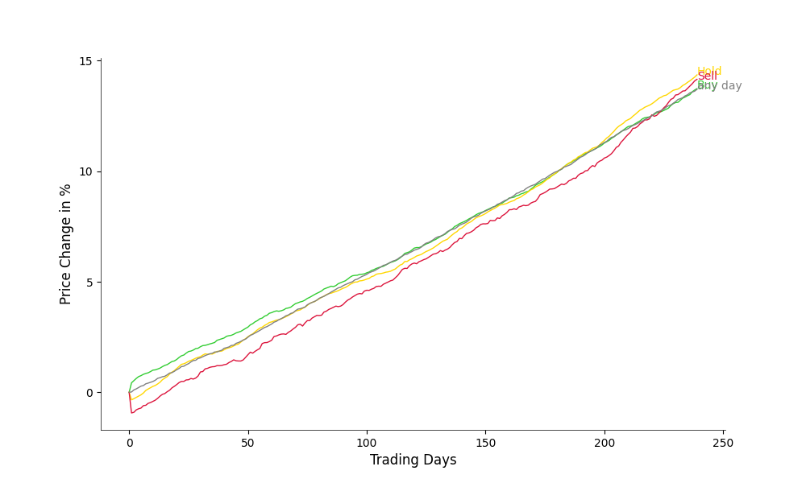
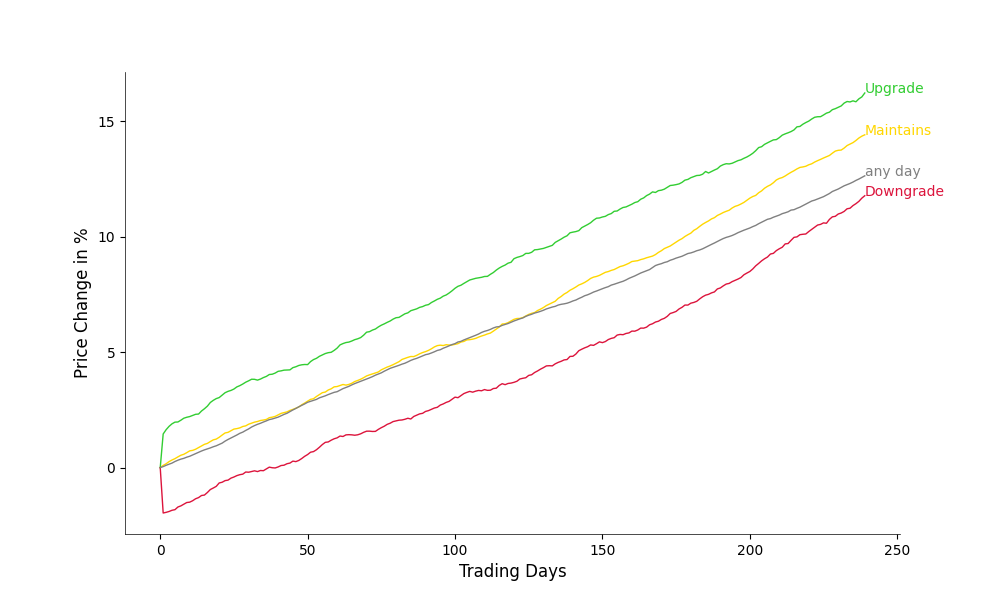

# Data Study - Should You Trust Stock Ratings by Analysts?

As I sometimes trade with mixed success, I often find myself wondering: 
Should I trust the advice of prominent stock analysts? 
Their recommendations—whether to `BUY`, `HOLD`, or `SELL`—are everywhere, from trading platforms to finance blogs. 
But are these ratings truly a roadmap to profit, or just noise that is better ignored?

Let us use the power of `Python`, `Pandas` and `Publicly available data` to perform a rigorous analysis. 

Feel free to perform your own experiments or suggest improvements!

---

## Methodology

### Hypothesis

If an analyst rates a stock as `BUY`, this should indicate that the stock is likely to 
outperform other stocks rated as `HOLD` or `SELL`.
With outperform, I hereby mean that its stock price develops - percentage-wise - more favourably in the future 
(e.g., the next days, months or years).
For this hypothesis to hold, stocks rated as `BUY` should - on average - show better returns 
than those with `HOLD` or `SELL` ratings over a certain time horizon.

To test the hypothesis, let us analyze retrospectively how stock prices developed after a rating. 
To do this statistically rigorously, let us use a large set of **ratings of the last 10 years** 
from larger **companies listed in the S&P 500 as of 2013**.
Focussing on those larger companies has the practical advantage that it is easier to obtain historical ratings -- since they usually receive more ratings which are also easier available.

Note that focussing on companies which are *currently* listed in an free-floating index like the S&P 500 
could result in a potential selection bias. 
Those companies are more likely to have a recently strong performance.

### Key Steps

#### Data Collection

**Historical analyst ratings** for S&P 500 stocks can be obtained from the Yahoo Finance website. 
These includes mostly ratings from major players but may not encompass all analysts.
**Daily closing stock prices** can be obtained via the popular yfinance API.
Finally, the ratings need to mapped to `BUY`, `HOLD`, and `SELL` as in [rating_mapping](src/api/rating_mapping.py).

#### Performance Measurement

As **baseline price** to compute the performance after a rating, let us use the 
close price of the day before the rating (Day 0).
This is the only option to have a price just before the rating, since the exact publishing time of the rating is not given in the data.

Based on the baseline price, the performance during the following **240 trading days** (approximately one year) is computed.for each rating.
Finally, the **mean performance** of all ratings of a category is computed.

Additionally, we also compute the performance after randomly selected days (chosen from within the considered time horizon for each stock).
This **any day** performance should reflect the mean performance after any day.

We can then compare the mean performance by (1) Visual inspection (plotting the mean performance curves against each other)
and (2) More statistically rigorous by perform t-tests between the categories at different points in time.

---

### Data Overview

From the Yahoo Finance website, **42,134** ratings could be collected 
(22,047 `Buy`, 17,169 `Hold`, 2,918 `Sell`).
Thus, the data is clearly unbalanced towards better ratings.

---

## Results

### Single Ratings as Signal

Let us start the analysis by looking of the mean performance of a stock after it received a rating.

|                     | Day 1   | Day 2   | Day 240 |
|---------------------|---------|---------|-------|
| `BUY` vs `HOLD`     | +0.8%** | +0.8%** | -0.6% |
| `BUY` vs `SELL`     | +1.4%** | +1.4%** | -0.4% |
| `BUY` vs `any day`  | +0.4%** | +0.4%** | +1.1%** |
| `HOLD` vs `SELL`    | +0.6%** | +0.6%** | +0.2% |
| `HOLD` vs `any day` | -0.4%** | -0.4%** | -1.0%** |
| `SELL` vs `any day` | -1.0%** | -1.0%** | +1.5% |
`*`: Significant at *p < 0.05*
`**`: Significant at *p < 0.01*

Ratings appear to influence the behaviour of some investors (as one might expect).
Within the first days after a `SELL` rating, the performance of the respective stock performs 2% worse on average than on any other day.
Similarly, a `BUY` rating motivates investors to buy the stock.

In strong contrast to this initial influence, there is no indication that negative ratings also predict a bad performance of the company and its stock in the next year.
The initial influence of the rating quickly disappears, and after one year the performance of the respective stock is comparable, 
independent of what rating it received.

Looking at these result, the smartest investment strategy would be even to wait out the initial performance decline after a `SELL` and `HOLD` rating and then buy the stock.

### Upgrades and Downgrades as Signal

Next to looking at the ratings itself, let us also analyze the effect of when an analyst changes the rating.
Upgrade means that the rating is improved with respect to the previous rating (of the same stock by the same analyst), and
Downgrade analogously.

Maintains: 19,489; Upgrade: 15,355 and Downgrade 2,608

|                     | Day 1   | Day 2   | Day 240 |
|---------------------|---------|---------|-------|
| `Upgrade` vs `Maintains`     | +1.4%** | +1.5%** | +1.8%** |
| `Upgrade` vs `Downgrade`     | +3.4%** | +3.6%** | +4.4%** |
| `Upgrade` vs `any day`  | +1.4%** | +1.5%** | +3.6%** |
| `Maintains` vs `Downgrade`    | +2.1%** | +2.1%** | +2.6%** |
| `Maintains` vs `any day` | +0.5%* | +0.7%* | +1.8%** |
| `Downgrade` vs `any day` | -2.0%** | -2.0%** | -0.9% |

Changes in ratings seem to result in more pronounced initial changes in the stock price.
However, the stock price development after the initial change seems to run almost in parallel.

## Aggregated Ratings as Signal

So far we looked at the impact of individual ratings. 
Commonly, the aggregated predictions of a larger group is more accurate than a single one, also known as wisdom of the crowd.
for each rating an **aggregated rating** is computed by taking the mean of all ratings in the last 3 months of the same stock (including the current one).
If the majority rated the stock a `BUY`, then also the aggregated rating is a `BUY`. 
If the mean rating is below 1 (where `SELL`==0 `HOLD`==1 and `BUY`==2), then the aggregated rating is a `SELL`.
Otherwise, the aggregated rating is a `HOLD`.
Note that we only consider ratings with at least four prior ratings in the past 3 months, 
resulting in **30,486** aggregated rating (16,404 `BUY`, 12,138 `HOLD` and 1,944 `SELL`).

|                     | Day 1   | Day 2   | Day 240 |
|---------------------|---------|---------|-------|
| `BUY` vs `HOLD`     | +0.7%** | +0.8%** | -1.1%* |
| `BUY` vs `SELL`     | +1.3%** | +1.3%** | -0.2% |
| `BUY` vs `any day`  | +0.3%** | +0.4%** | +1.6%** |
| `HOLD` vs `SELL`    | +0.6%** | +0.5%** | +0.9% |
| `HOLD` vs `any day` | -0.4%** | -0.4%** | +2.6%** |
| `SELL` vs `any day` | -1.0%** | -0.9%** | +1.8% |

The results are similar to the individual ratings.
This suggests that the effect of an individual rating on the performance of a stock is independent of any previous ratings.

### Discussion

Causal direction?
No mid-term effect / accuracy of rating!
