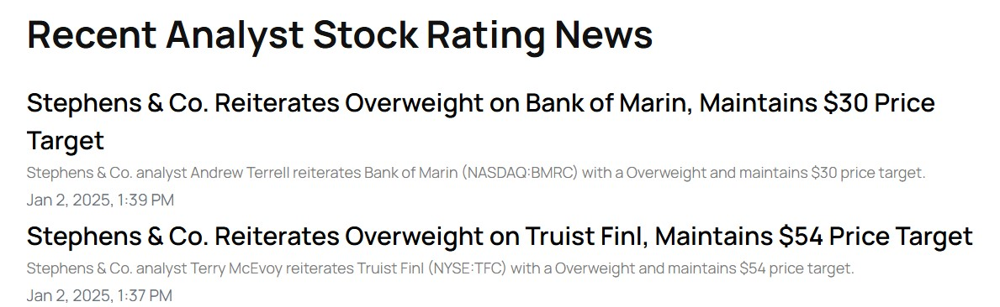
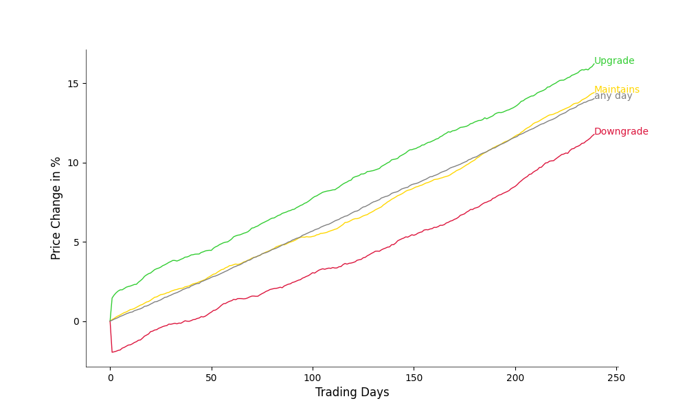
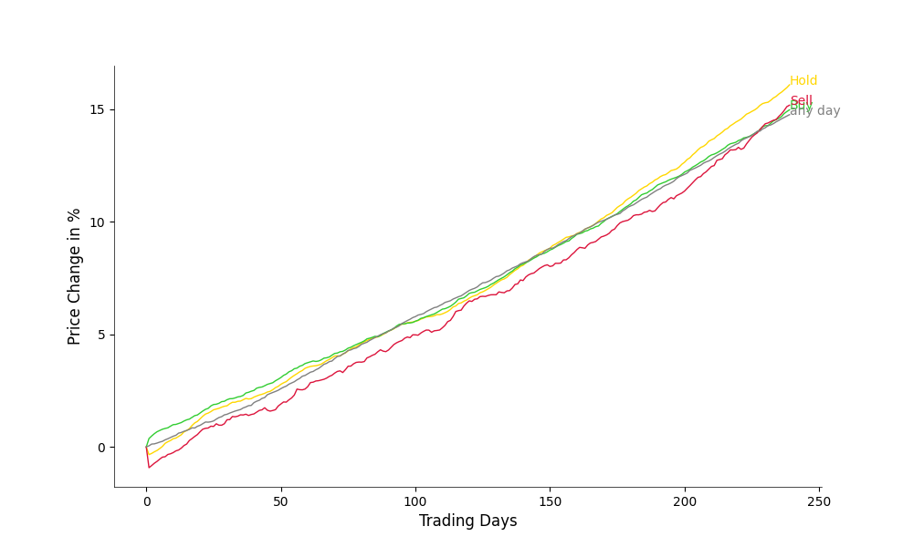

# Data Study - Should You Trust Stock Ratings by Analysts?

As I sometimes trade with mixed success, I often find myself wondering: 
Should I trust the advice of prominent stock analysts? 
Their recommendations—whether to `BUY`, `HOLD`, or `SELL`—are everywhere, from trading platforms to finance blogs. 
But are these ratings truly a roadmap to profit, or just noise that is better ignored?

Let us use the power of `Python`, `Pandas` and `Publicly available data` to perform a rigorous analysis. 

Feel free to replicate the analysis, propose improvements, or extend the study to suit your trading strategy!
Just run [src/run_experiments](src/run_experiments.py)

---

## Methodology

### Hypothesis

Analyst ratings should ideally predict future stock performance.
Thus, stocks rated BUY should outperform those rated HOLD or SELL at some (not too far) point in the future.

To test this hypothesis, let us analyze how stock prices evolved after receiving ratings over the past 10 years, focusing on S&P 500 companies as of 2013.
Limiting the dataset to large-cap stocks has the practical advantage that it is easier to obtain historical ratings
(though this might introduce some selection bias as discussed later).

### Key Steps

#### Data Collection

- **Historical analyst ratings** Obtained from Yahoo Finance, encompassing ratings from major firms. These are mapped to `BUY`, `HOLD`, and `SELL` categories using [rating_mapping](src/api/rating_mapping.py) and cleaned in [RatingAPI](src/api/rating_loader.py).
- **Daily closing stock prices** can be obtained via the popular yfinance API and are loaded and cleaned with [StockPricesAPI](src/api/rating_loader.py).

#### Performance Measurement

- As **baseline price** let use the closing price on the day before the rating (Day 0), as exact publication times for ratings were unavailable.
- Performance is tracked over 240 trading days (~1 year) following each rating in [compute_performance_after_rating](src/analytics/performance.py). The average performance of each rating category is then computed in [compute_mean_performance_after_rating](src/analytics/performance.py).
- For comparison, a **random baseline (any day)** is created by computing the average performance starting from randomly selected days (accounting for differences in ratings per company and year)

We can then compare the average performance by 
- Visual inspection (plotting the average performance curves against each other in [plot_mean_performance](src/plotting/price_change.py)
- More statistically rigorous by performing t-tests between the ratings categories and the baseline at different points in time in [perform_t_tests](src/analytics/t_tests.py).

---

### Data Overview

From Yahoo Finance 42,134 ratings from 219 / 497 S&P 500 companies (as of 2013) could be collected:

`BUY`: 22,047
`HOLD`: 17,169
`SELL`: 2,918

Thus, the data is skewed toward positive ratings (`BUY` and `HOLD`) and more recent ratings.

---

## Results

### Single Ratings as Signal

The chart below shows the average stock performance 
after receiving a `BUY`, `HOLD`, or `SELL rating`, compared to the random baseline.

|                     | Day 1 Change | Day 240 Change |
|---------------------|--------------|----------------|
| `BUY` vs `any day`  | +0.4%**      | +0.0%          |
| `HOLD` vs `any day` | -0.4%**      | +0.7%          |
| `SELL` vs `any day` | -1.0%**      | +0.5%          |

`*`: Significant at *p < 0.01*
`**`: Significant at *p < 0.001*

Stock prices react strongly on the day a rating is published.
On the day of a `BUY` rating, the price ends up 0.4% higher than on any other day on average.
On the day of `HOLD` and `SELL` ratings, the prices end up lower than on other days on average.
However, causality is unclear.
Ratings often coincide with events like earnings reports or news, 
making it difficult to determine whether ratings drive price changes or reflect market reactions.

After the initial Day 1 reaction, stock performance over the next year shows no meaningful difference between ratings.
This suggests that ratings do not predict future stock performance.
A counterintuitive strategy might even involve buying stocks after a `SELL` or `HOLD` rating 
once their initial decline stabilizes.

### Upgrades and Downgrades as Signal

Next to looking at the ratings itself, let us also analyze the effect of a change in rating by an analyst.
With `Upgrade` (15,355) the rating was improved with respect to the previous rating (of the same stock by the same analyst), 
with `Downgrade` (2,608) it was worsened, and with `Maintained` (19,489) it was reiterated.

|                     | Day 1 Change | Day 240 Change |
|---------------------|--------------|---------------|
| `Upgrade` vs `any day`  | +1.4%**      | +2.2**        |
| `Maintains` vs `any day` | +0.1%        | +0.4%         |
| `Downgrade` vs `any day` | -2.0%**      | -2.3%**       |

Changes in ratings coincide with an even more pronounced change on Day 1.
Again, the direction of causality is unclear. 
A rating is probably likely to change, for example because a company heavily over- or underperformed in the last quarter.
After the initial change on Day 1 the prices developed similarly, independent of the rating
-with `Upgrades` developing slightly more favourable than `Downgrades`.

## Aggregated Ratings as Signal

So far we looked at the impact of individual ratings. 
Commonly, the aggregated predictions of a larger group is more accurate than a single one, also known as wisdom of the crowd.

For each rating an **aggregated rating** is computed by taking the average of all ratings in the last 3 months of the same stock (including the current one).
If the majority rated the stock a `BUY`, then the aggregated rating is a `BUY`. 
If the average rating is below 1 (where `SELL`==0 `HOLD`==1 and `BUY`==2), then the aggregated rating is a `SELL`.
Otherwise, the aggregated rating is a `HOLD`.

Only ratings with at least four prior ratings in the past 3 months are considered, 
resulting in **30,486** aggregated rating (16,404 `BUY`; 12,138 `HOLD`; 1,944 `SELL`).

|                     | Day 1  | Day 240 |
|---------------------|-------|---------|
| `BUY` vs `any day`  | +0.3%** | +0.2%   |
| `HOLD` vs `any day` | -0.4%**| +1.3%*  |
| `SELL` vs `any day` | -1.0%** | +0.4%   |

The results are quite simular to the results of individual ratings.
Thus, aggregated ratings did not provide additional predictive power beyond individual ratings, 
reinforcing the idea that analyst ratings fail to forecast long-term performance.

### Discussion

So, should you trust analysts ratings?

The results indicate that analyst ratings are **not reliable predictors** of future stock performance.
Ratings appear to influence Day 1 price movements, likely due to coinciding news or investor sentiment.
However, stock returns over a year are independent of the ratings received.
In essence, analyst ratings might reflect market sentiment or recent performance, 
but they seem to lack predictive value for future returns. 

#### Limitations
1. **Selection Bias**
Ratings were retrieved for large-cap companies listed in the S&P 500 in 2013, potentially excluding underperforming companies (which not even be listed anymore on the website). This might also explain the relatively large annual return of more than 13%.

2. **Causality**
The lack of precise timestamps prevents disentangling the influence of ratings from external events (e.g., earnings reports).

3. **Dataset Scope**
The dataset does not contain smaller-cap or international stocks, which might show different trends.

